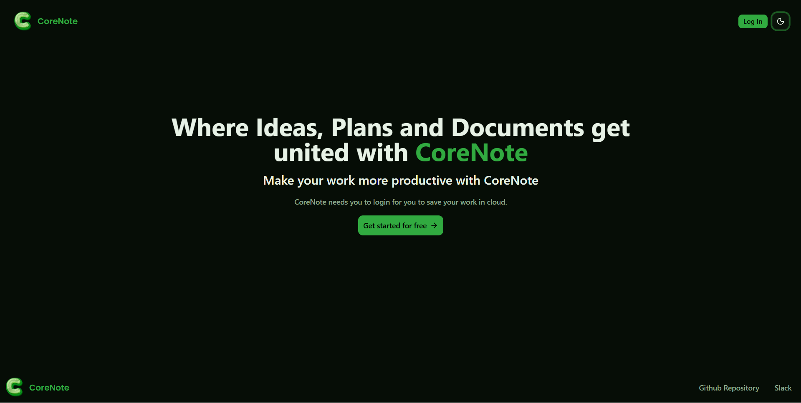
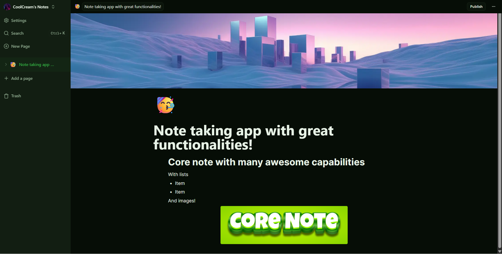

# Core Note
## The fully advanced and note taking app. 
### Trying to make it look like notion because I love its ui

## What its made with
This is an awesome note taking app made with next.js, tailwind css and BlocknoteJS

## Features
Supports images, covers, icons headings, lists and all kinds of things u couls possibly imagine.

## Where I struggled:
I struggled a lot while trying to implement the cover image system, search and the deleting notes feature. This was so difficult i spent almost 4-5 hours combined for fixing bugs related to these.

## Easy work:
It was really easy to create the 404 error page and the home page. These were the simplest features.

## Gallery:

